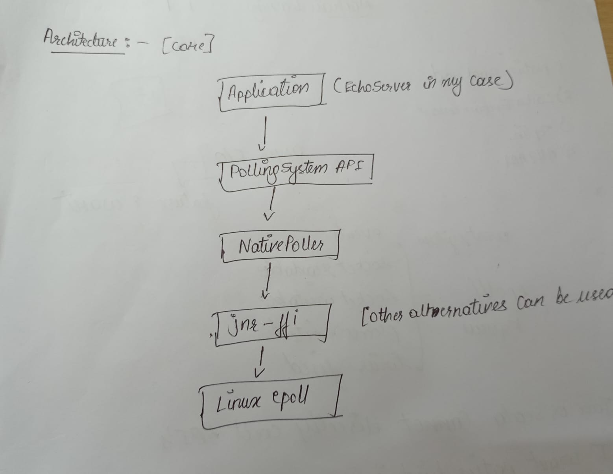

# Native Epoll Polling System for Cats Effect

[](https://www.scala-lang.org/)
[](https://typelevel.org/cats-effect/)
[](https://man7.org/linux/man-pages/man7/epoll.7.html)

Prototype of a **native Linux epoll-based PollingSystem** for Cats Effect IO runtime, using **jnr-ffi** for direct system calls.

Implements efficient fiber suspension/resumption on fd readiness via `Selector.select(fd, ops): IO[Int]`.

## Project Structure

```
native-poller/
├── README.md
├── build.sbt
├── .gitignore
├── image.png
├── core/
│   └── src/main/scala/com/example/
│       ├── Selector.scala              # Selector trait
│       ├── test.scala                  # Epoll tests
│       └── epollSystem/
│           ├── EpollSystem.scala       # PollingSystem impl
│           └── NativeEpoll.scala       # jnr-ffi epoll bindings
└── example/
    └── src/main/scala/com/example/nativepoller/example/
        └── EchoServer.scala            # TCP echo server demo
├── project/                           # sbt config
└── target/                            # build artifacts
```

## Architecture



## Core Components

### `Selector` Trait (core/src/main/scala/com/example/Selector.scala)

```scala
trait Selector {
  def select(fd: Int, ops: Int): IO[Int]  // Suspend until fd ready (EPOLLIN/EPOLLOUT)
}
```

- `Selector.get`: IO[Selector] from IO runtime.
- Used by apps to await fd readiness.

### `NativeEpoll` (core/src/main/scala/com/example/epollSystem/NativeEpoll.scala)

**jnr-ffi bindings** to Linux libc:

- `create()` / `close(fd)`
- `ctlAddOrMod(epollFd, fd, events)` / `ctlDel`
- `wait(epollFd, timeout)` / `drain(epollFd): Array[EpollEvent]`
- `createEventFd()` / `wakeup(eventFd)` / `clearEventFd`
- Events: `EPOLLIN=1`, `EPOLLOUT=4`, etc.
- `EpollEvent(fd: Int, events: Int)`

### `EpollSystem` (core/src/main/scala/com/example/epollSystem/EpollSystem.scala)

**Cats Effect `PollingSystem`** implementation:

- `makePoller()`: Creates epollFd + eventFd, registers eventFd.
- `poll(poller, nanos)`: `epoll_wait` with timeout.
- `processReadyEvents(poller)`: Drains events, invokes callbacks, handles interrupt.
- `SelectorImpl`: `select(fd, ops)` registers callback on poller.callbacks (ConcurrentHashMap), `ctlAddOrMod`.
- `Poller extends PollerMetrics`: Full metrics (submitted/succeeded/errored/canceled ops).
- Linked-list `Callbacks#Node` for multi-callback per fd.
- Interrupt: `wakeup(eventFd)`.

### Tests (`test.scala`)

Basic epoll + eventfd create/register/wakeup/drain/clear test.

## Running the Echo Server Example

EchoServer demonstrates `Selector` usage: non-blocking TCP server on 127.0.0.1:8080.

**Uses native socket/bind/listen/accept/read/write** via jnr-ffi TcpLibC.

Fibers suspend via `selector.select(clientFd, EPOLLIN/OUT)` for echo loop.

```bash
# Build
sbt compile

# Run server
sbt "example/runMain com.example.nativepoller.example.EchoServer"
```

**Expected output:**

```
=== Native Epoll TCP Echo Server running on 127.0.0.1:8080 ===
Test with: nc 127.0.0.1 8080
```

**Test:**

```bash
nc 127.0.0.1 8080
# type "hello" -> echoes "hello"
```

## Requirements

- **Linux** (epoll required)
- **Java 21+**
- **sbt**
- `netcat` (nc) for testing

## Note

This is Prototype under development. Uses jnr-ffi for native calls.
