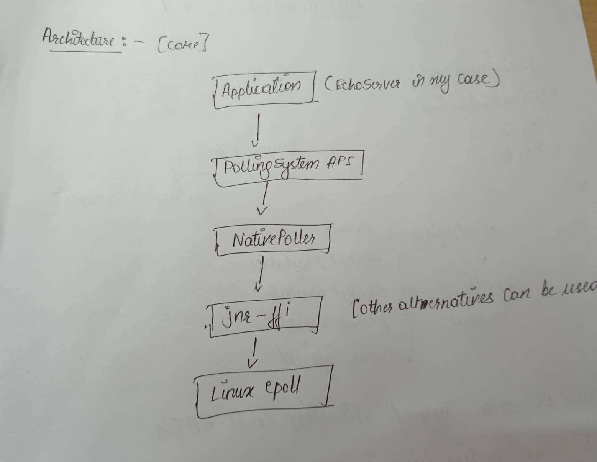

# Native Poller Prototype (Scala + Cats Effect)

[](https://www.scala-lang.org/)
[](https://www.scala-sbt.org/)
[](https://www.kernel.org/doc/html/latest/core-api/genalloc.html)
[](https://typelevel.org/cats-effect/)

A prototype implementation of a **native event-driven I/O polling system** for the JVM using **Linux `epoll`**, built with **Scala and Cats Effect**.

This project attempts to upgrade the traditional **JDK NIO selector-based IO Backend** with a **direct native polling Backend**, with reference to **https://github.com/armanbilge/fs2-io_uring**.

The goal is to demonstrate a **low-latency, high-throughput polling Backend** that could eventually integrate with **FS2**.

## Table of Contents

- [Project Structure](#project-structure)
- [core](#core)
- [example](#example)
- [Proposed Architecture](#proposed-architecture)
- [Running the Example](#running-the-example)
- [Current Implementation](#current-implementation)
- [Current Limitations](#current-limitations)
- [Future Improvements](#future-improvements)
- [Comparison](#comparison)
- [Why This Matters](#why-this-matters)

# Project Structure

```
native-poller/
│
├── core/
│   ├── NativeEpoll.scala
│   ├── EpollSystem.scala
│
├── example/
│   └── src/main/scala/com/example/nativepoller/example/
│       └── EchoServer.scala
│
├── build.sbt
├── project/
└── README.md
```

## core

Contains the **native polling runtime**.

Responsibilities:

- epoll integration
- file descriptor registration
- event loop

Key components:

```
EpollSystem
     ↓
NativeEpoll
     ↓
jnr-ffi bindings
     ↓
Linux epoll
```

---

## example

Contains a **demo TCP echo server** built using the polling runtime.

It demonstrates how an application can use:

```
polling.untilReadable(fd)
```

to suspend a fiber until a socket becomes ready.

---

# Proposed Architecture



Flow of an event:

```
client sends data
      ↓
socket becomes readable
      ↓
epoll_wait wakes event loop
      ↓
fiber waiting on fd is resumed
      ↓
read() is executed
      ↓
data echoed back
```

---

# Running the Example

## Quick Start

```bash
# Clone & cd
git clone <repo-url> native-poller
cd native-poller

# Install deps (Ubuntu/Debian)
sudo apt update
sudo apt install sbt netcat-openbsd

# Build & run example
sbt compile
sbt "example/runMain com.example.nativepoller.example.EchoServer"
```

Server will listen on `127.0.0.1:8080`.

Test with:

```bash
nc 127.0.0.1 8080
```

## Requirements

- Linux (epoll required) or WSL2
- Java 21+
- sbt 1.x

Install dependencies:

```
sudo apt update
sudo apt install sbt netcat-openbsd
```

Run the server:

```
sbt example/run
```

Output:

```
Native TCP Echo Server running on 127.0.0.1:8080
```

Test the server:

```
nc 127.0.0.1 8080
```

Type:

```
hello
```

Expected response (on your backend):

```
hello
```

---

# Current Implementation

This prototype currently supports:

### Native socket operations

- socket
- bind
- listen
- accept
- read

### Polling system

- epoll event loop
- fd readiness detection
- fiber suspension until fd becomes readable

### Cats Effect integration

Fibers are suspended until an event occurs.

```
polling.untilReadable(fd)
```

---

# Current Limitations

The current prototype is intentionally minimal and has several limitations.

### Limited event support

Currently only:

```
READABLE events
```

are handled.

Writable readiness is not implemented.

### No backpressure handling

The example server performs direct reads and writes without a structured streaming layer.

### Single event loop

The prototype uses a single poller thread.

### No FS2 integration

The current implementation works directly with raw sockets rather than FS2 streams.

# Future Improvements

The prototype serves as a **foundation for a full native I/O backend**.

Future work includes:

## Writable readiness support

Add:

```
untilWritable(fd)
```

to allow non-blocking writes.

---

## FS2 integration

Expose the polling runtime to **FS2** so sockets can be represented as streams.

Example future API:

```
Socket.reads
Socket.writes
```

## A FallBack Mechanism

If native polling is unavailable (for example on non-Linux systems such as windows or when epoll cannot be initialized), the system can fall back to the standard JVM based on Java NIO selectors. This ensures reliability and portability while still allowing Backend Running even if it fails.

---

# Comparison

| Feature         | Current Prototype | Future Implementation     |
| --------------- | ----------------- | ------------------------- |
| Polling         | epoll             | epoll + kqueue(for macos) |
| Thread model    | single event loop | multi-core event loops    |
| IO API          | raw sockets       | FS2 streaming             |
| Write readiness | not implemented   | full support              |

---

# Why This Matters

This prototype explores the possibility of building a **native I/O backend for FS2**.

Potential benefits:

- lower latency
- higher throughput

## Contributing

Contributions welcome! See [CONTRIBUTING.md](CONTRIBUTING.md) (create if needed).

## License

Prototype - MIT License (or specify).

# Note

> This is just a prototype under active development. It may have flaws or unexpected behavior. Use at your own risk.
